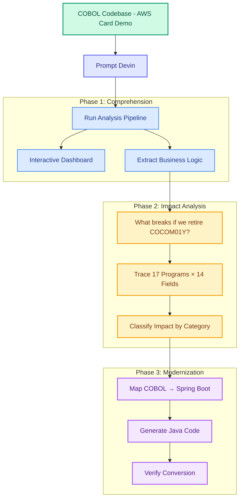
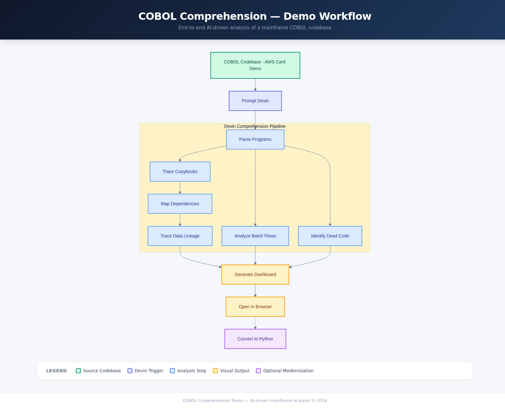

# COBOL Comprehension Demo

AI-driven mainframe COBOL comprehension, impact analysis, and live modernization — analyzing a real credit card transaction processing system end-to-end.



[View interactive flowchart (HTML)](docs/flowchart.html)

<details>
<summary>Flowchart (PNG fallback)</summary>


</details>

## What This Demo Shows

Devin comprehends a real-world COBOL codebase (the [AWS Card Demo](https://github.com/aws-samples/aws-mainframe-modernization-carddemo) — a credit card transaction processing system with 44 programs, 62 copybooks, and 46 JCL batch jobs) and does three things that require AI reasoning, not just script execution:

1. **Extracts business logic** — reads COBOL PROCEDURE DIVISIONs and produces structured documentation of every business rule, citing specific paragraphs and line numbers
2. **Answers impact questions** — traces what breaks if you retire a shared copybook, classifying the blast radius by field and program
3. **Converts to modern code** — transforms a COBOL program to Spring Boot Java with field-by-field mapping grounded in the source

Comprehension is the hardest part of mainframe modernization — 68% of efforts fail because teams don't understand what the code does before they try to change it.

## How the Demo Runs

**Trigger prompt** (paste this into a fresh Devin session):

> Analyze the CardDemo COBOL application in `carddemo-source/`. Run the comprehension pipeline and open the dashboard. Then extract the business logic from the sign-on flow through the transaction screens — read the actual COBOL PROCEDURE DIVISIONs and document every business rule you find. After that, tell me what would break if we retired the `COCOM01Y` copybook — trace every program that uses it and classify the impact by field. Finally, convert the sign-on program `COSGN00C` to a Spring Boot REST controller with equivalent authentication logic and write it to `modernization_example/`.

Devin follows the [comprehend-and-modernize playbook](.devin/playbooks/comprehend-and-modernize.md) and produces:

| Phase | Duration | Output |
|---|---|---|
| 1. Comprehension | ~5 min | Dashboard at localhost:8000 + `docs/business_rules.md` |
| 2. Impact Analysis | ~3 min | `docs/impact_analysis_COCOM01Y.md` |
| 3. Modernization | ~5 min | Spring Boot project in `modernization_example/` |

See [DEMO_NOTES.md](DEMO_NOTES.md) for the full presenter cheat sheet with talk tracks.

### Local Development

```bash
git clone --recurse-submodules https://github.com/tedfoley-cog/cobol-comprehension-demo.git
cd cobol-comprehension-demo
pip install -r requirements.txt

# Run analysis
python -m analysis.generate_dashboard_data carddemo-source/app dashboard/data

# Serve dashboard
python -m http.server 8000 --directory dashboard
# Open http://localhost:8000
```

## Repo Layout

```
cobol-comprehension-demo/
├── carddemo-source/           # Git submodule — AWS Card Demo COBOL source
│   └── app/
│       ├── cbl/               # 44 COBOL programs
│       ├── cpy/               # 62 copybooks
│       ├── jcl/               # 46 JCL batch jobs
│       └── bms/               # BMS screen maps
├── analysis/                  # Python analysis scripts (scaffolding)
│   ├── parse_cobol.py         # Extract program structure, COPY refs, CALLs
│   ├── parse_copybooks.py     # Parse field definitions, byte offsets
│   ├── parse_jcl.py           # Extract job steps, DD statements
│   ├── build_dependency_graph.py  # Program→copybook→program graph
│   ├── find_dead_code.py      # Unreferenced programs/copybooks
│   ├── trace_data_lineage.py  # File I/O and shared copybook mapping
│   ├── deep_analysis.py       # Field cross-refs, COMMAREA flows, impact
│   └── generate_dashboard_data.py # Orchestrator — runs all analyses
├── dashboard/                 # Interactive comprehension dashboard
│   ├── index.html             # 8-tab dashboard with deep analysis views
│   ├── css/style.css
│   ├── js/app.js
│   └── data/                  # JSON output (populated at demo time)
├── modernization_example/     # Empty — Devin fills this during Phase 3
├── .devin/
│   └── playbooks/
│       └── comprehend-and-modernize.md  # 3-phase demo playbook
├── docs/
│   ├── IMPLEMENTATION_PLAN.md
│   ├── flowchart.html
│   └── flowchart.png
├── DEMO_NOTES.md              # Presenter cheat sheet with talk tracks
└── README.md
```

## Key Concepts

| Term | Description |
|---|---|
| **Copybook** | Shared COBOL data layout included via `COPY` statement; defines field structures at fixed byte offsets |
| **COMMAREA** | Communication area passed between CICS programs via XCTL/LINK; the application's session state |
| **WORKING-STORAGE** | Program-local data area where variables and copybook fields are defined |
| **PROCEDURE DIVISION** | The executable logic section of a COBOL program |
| **XCTL** | CICS transfer control — passes COMMAREA to the next program (no return) |
| **JCL (Job Control Language)** | z/OS scripting language that chains batch programs and defines I/O datasets |
| **BMS Map** | CICS screen definition for 3270 terminal UI rendering |
| **REDEFINES** | COBOL keyword that overlays two different field structures on the same memory |
| **Implicit connection** | Fields in different copybooks with matching PIC and byte size — invisible coupling |
| **Dead code** | Programs or copybooks that are never referenced by any CALL, COPY, or JCL EXEC |
