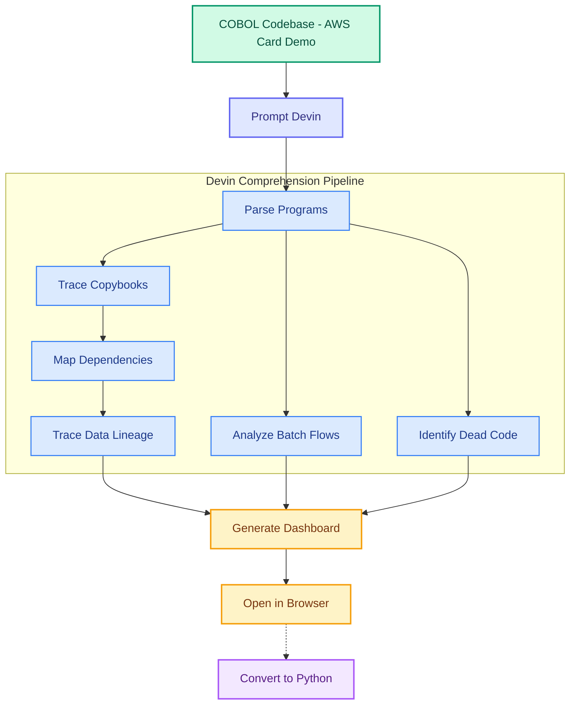

# COBOL Comprehension Demo

AI-driven mainframe COBOL comprehension and dependency mapping — analyzing a real credit card transaction processing system end-to-end.



[View interactive flowchart (HTML)](docs/flowchart.html)

<details>
<summary>Flowchart (PNG fallback)</summary>


</details>

## What This Demo Shows

Devin comprehends a large, real-world COBOL codebase (the [AWS Card Demo](https://github.com/aws-samples/aws-mainframe-modernization-carddemo) — a credit card transaction processing system with 31 programs, 30+ copybooks, and 38 JCL batch jobs) and produces a comprehensive system-wide map in minutes. The analysis covers dependency graphs, copybook field tracing, batch-flow documentation, data lineage, and dead-code identification. As a secondary step, Devin converts one representative program to Python with equivalence tests.

Comprehension is the hardest part of mainframe modernization — 68% of efforts fail because teams don't understand what the code does before they try to change it. A single misidentification at one program boundary makes every subsequent change incorrect.

## What Devin Does Live

Devin runs the entire comprehension workflow inside a live Devin session: parsing all COBOL programs, tracing copybook dependencies across byte offsets, mapping program-to-program call chains, analyzing JCL batch flows, identifying dead code, and generating an interactive dashboard that visualizes the complete system map. The presenter opens the dashboard in the browser to show the results. Optionally, Devin then picks one program (e.g., `CBTRN02C` — daily transaction processing) and converts it to Python with tests.

## How the Demo Runs

1. **Trigger**: Prompt Devin in a fresh session with: *"Analyze the COBOL source in carddemo-source/ and populate the comprehension dashboard"*
2. **Devin runs the analysis pipeline**: `python -m analysis.generate_dashboard_data carddemo-source/app dashboard/data`
3. **Devin serves the dashboard**: `python -m http.server 8000 --directory dashboard`
4. **Presenter opens the dashboard** in the browser tab to walk through each panel
5. **(Optional)** Prompt Devin: *"Convert CBTRN02C to Python in modernization_example/"*

### Local Development

```bash
git clone --recurse-submodules https://github.com/tedfoley-cog/cobol-comprehension-demo.git
cd cobol-comprehension-demo
pip install -r requirements.txt

# Run analysis
python -m analysis.generate_dashboard_data carddemo-source/app dashboard/data

# Serve dashboard
python -m http.server 8000 --directory dashboard
# Open http://localhost:8000
```

## Repo Layout

```
cobol-comprehension-demo/
├── carddemo-source/           # Git submodule — AWS Card Demo COBOL source
│   └── app/
│       ├── cbl/               # 31 COBOL programs
│       ├── cpy/               # 30 copybooks
│       ├── jcl/               # 38 JCL batch jobs
│       └── bms/               # 17 BMS screen maps
├── analysis/                  # Python analysis scripts
│   ├── parse_cobol.py         # Extract program structure, COPY refs, CALLs
│   ├── parse_copybooks.py     # Parse field definitions, byte offsets
│   ├── parse_jcl.py           # Extract job steps, DD statements
│   ├── build_dependency_graph.py  # Program→copybook→program graph
│   ├── find_dead_code.py      # Unreferenced programs/copybooks
│   ├── trace_data_lineage.py  # File I/O and shared copybook mapping
│   └── generate_dashboard_data.py # Orchestrator — runs all analyses
├── dashboard/                 # Interactive comprehension dashboard
│   ├── index.html             # Main dashboard (empty until analysis runs)
│   ├── css/style.css
│   ├── js/app.js
│   └── data/                  # JSON output from analysis (populated at demo time)
├── modernization_example/     # Empty — Devin fills this during the live demo
├── docs/
│   ├── IMPLEMENTATION_PLAN.md
│   ├── flowchart.html
│   └── flowchart.png
└── DEMO_NOTES.md              # Presenter cheat sheet
```

## Key Concepts

| Term | Description |
|---|---|
| **Copybook** | Shared COBOL data layout included via `COPY` statement; defines field structures at fixed byte offsets |
| **WORKING-STORAGE** | Program-local data area where variables and copybook fields are defined |
| **PROCEDURE DIVISION** | The executable logic section of a COBOL program |
| **JCL (Job Control Language)** | z/OS scripting language that chains batch programs and defines I/O datasets |
| **BMS Map** | CICS screen definition for 3270 terminal UI rendering |
| **EXEC PGM=** | JCL statement that invokes a compiled COBOL program |
| **DD DSN=** | JCL statement defining a dataset (file) for program I/O |
| **REDEFINES** | COBOL keyword that overlays two different field structures on the same memory |
| **Dead code** | Programs or copybooks that are never referenced by any CALL, COPY, or JCL EXEC |
| **Data lineage** | Tracing how data flows from datasets through programs via copybook field mappings |
